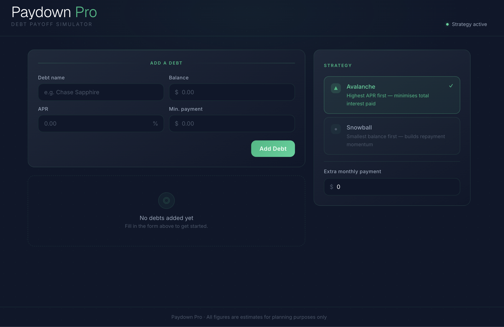

# Paydown Pro



A debt payoff simulator built with Next.js. Add your debts, pick a strategy (avalanche or snowball), set an extra monthly payment, and get a month-by-month payoff schedule.

## Getting Started

```bash
npm install
npm run dev
```

Open [http://localhost:3000](http://localhost:3000).

## Commands

```bash
npm run dev      # Start development server
npm run build    # Production build
npm run lint     # Run ESLint
npm run start    # Start production server
```

## Stack

- **Next.js 16.2.1** App Router
- **React 19**
- **TypeScript** (strict mode)
- **Tailwind CSS v4** (via `@tailwindcss/postcss` — no `tailwind.config.*` file)
- **Fonts:** DM Serif Display, DM Sans, DM Mono via `next/font/google`

## Project Structure

```
src/
  app/
    layout.tsx       # Root layout — fonts, global styles
    page.tsx         # Home page (Server Component)
    globals.css      # Tailwind + design tokens + component classes
  components/
    DebtForm.tsx     # Add a debt
    DebtList.tsx     # List debts with remove buttons
    StrategyToggle.tsx  # Avalanche/snowball toggle + extra payment
    Results.tsx      # Month-by-month payoff schedule
  store/
    debts.tsx        # DebtProvider context + useDebts() hook
  lib/
    payoff.ts        # Pure calculatePayoff() — no React
  types/
    debt.ts          # Shared TypeScript types
```
